# 🎓 Distributed Systems Analysis: Your Project vs. Real Distributed Systems

## ❓ Your Question: Is This Really Distributed?

**Short Answer**: Your system is **PARTIALLY distributed** - it demonstrates some distributed concepts but has a **Single Point of Failure** (the central server).

---

## 🔍 What You Have: Hybrid Architecture

### Current Design Classification:
**"Distributed Processing with Centralized Storage"**

```mermaid
graph TB
    subgraph "DISTRIBUTED LAYER ✅"
        ATM1[ATM Node 1]
        ATM2[ATM Node 2]
        ATM3[ATM Node 3]
    end
    
    subgraph "CENTRALIZED LAYER ❌"
        Server[Bank Server<br/>SINGLE POINT OF FAILURE]
        DB[(accounts.csv)]
    end
    
    ATM1 <-->|Peer Communication| ATM2
    ATM2 <-->|Peer Communication| ATM3
    ATM1 <-->|Peer Communication| ATM3
    
    ATM1 -->|Depends On| Server
    ATM2 -->|Depends On| Server
    ATM3 -->|Depends On| Server
    
    Server --> DB
    
    style Server fill:#ff6b6b
    style DB fill:#ff6b6b
    style ATM1 fill:#51cf66
    style ATM2 fill:#51cf66
    style ATM3 fill:#51cf66
```



---

## ✅ What IS Distributed in Your System

### 1. **Distributed Transaction Processing**
- Multiple ATM nodes can process transactions independently
- Each node runs on a different computer
- Load can be distributed across nodes

### 2. **Distributed Mutual Exclusion** ⭐ (MOST IMPORTANT)
- ATM nodes coordinate with each other using consensus
- Implements **Ricart-Agrawala** or similar algorithm
- Prevents race conditions without a central lock manager
- This is a **genuine distributed systems concept**

### 3. **Peer-to-Peer Communication**
- ATM nodes talk directly to each other
- No central coordinator for locking decisions
- Demonstrates **distributed consensus**

### 4. **Fault Tolerance (Partial)**
- If ATM1 crashes, ATM2 and ATM3 can still process transactions
- Multiple nodes provide redundancy for processing

---

## ❌ What is NOT Distributed (The Problem)

### 1. **Centralized Data Storage** 🚨
```
Problem: Single Bank Server stores ALL data
Result: If server crashes → ENTIRE SYSTEM FAILS
```

### 2. **Single Point of Failure (SPOF)**
```
Server Down = No Data Access = System Unusable
```

### 3. **No Data Replication**
```
Only ONE copy of accounts.csv exists
If that file corrupts → ALL DATA LOST
```

### 4. **No Server Redundancy**
```
Only ONE server instance
No backup or failover mechanism
```

---

## 📊 Comparison Table

| Feature | Your System | True Distributed System |
|---------|-------------|-------------------------|
| **Multiple Processing Nodes** | ✅ Yes (3 ATM nodes) | ✅ Yes |
| **Distributed Locking** | ✅ Yes (peer consensus) | ✅ Yes |
| **Peer Communication** | ✅ Yes (ATM to ATM) | ✅ Yes |
| **Replicated Data** | ❌ No (single CSV) | ✅ Yes (multiple copies) |
| **Fault-Tolerant Storage** | ❌ No (SPOF) | ✅ Yes (redundant servers) |
| **Server Redundancy** | ❌ No (1 server) | ✅ Yes (multiple servers) |
| **Automatic Failover** | ❌ No | ✅ Yes |
| **Data Consistency Protocol** | ⚠️ Partial (locks only) | ✅ Yes (Paxos/Raft) |

---

## 🎯 Real Distributed Systems Examples

### Example 1: **Cassandra** (True Distributed Database)
```
- Data replicated across multiple servers
- No single point of failure
- Any server can fail without data loss
- Automatic failover and recovery
```

### Example 2: **Bitcoin** (Fully Decentralized)
```
- Every node has complete copy of blockchain
- No central server at all
- Consensus through Proof-of-Work
- Completely fault-tolerant
```

### Example 3: **Google's Spanner** (Distributed Database)
```
- Data replicated globally across data centers
- Synchronous replication
- Survives entire data center failures
- Strong consistency guarantees
```

---

## 🏆 Your System's Strengths (What You DID Right)

### 1. **Distributed Mutual Exclusion** ⭐⭐⭐
This is the **CORE** distributed systems concept you're demonstrating:

```java
// ATM nodes coordinate WITHOUT a central lock server
ATM1: "Can I access Account #123?"
ATM2: "Yes, I'm not using it"
ATM3: "Yes, go ahead"
ATM1: Proceeds with transaction
```

**This IS a real distributed algorithm!**

### 2. **Consensus-Based Coordination**
- Nodes vote on transaction requests
- Demonstrates **distributed decision-making**
- Shows understanding of race conditions

### 3. **Scalable Processing**
- Can add more ATM nodes easily
- Processing load is distributed
- No bottleneck at processing layer

---

## 🚨 The Critical Weakness: Storage Layer

### Current Problem:
```
┌─────────┐  ┌─────────┐  ┌─────────┐
│  ATM 1  │  │  ATM 2  │  │  ATM 3  │  ← Distributed ✅
└────┬────┘  └────┬────┘  └────┬────┘
     │            │            │
     └────────────┼────────────┘
                  │
            ┌─────▼─────┐
            │  Server   │  ← Centralized ❌ SPOF!
            └─────┬─────┘
                  │
            ┌─────▼─────┐
            │ CSV File  │  ← Single copy ❌
            └───────────┘
```

### What Happens When Server Fails:
```
Server Crashes
    ↓
No data access
    ↓
ATM nodes can't read/write accounts
    ↓
ENTIRE SYSTEM STOPS
```

---

## 💡 How to Make It "Truly" Distributed

### Option 1: **Replicated Database** (Recommended for Learning)

Each node maintains its own copy of the database:

```
┌─────────┐      ┌─────────┐      ┌─────────┐
│  ATM 1  │◄────►│  ATM 2  │◄────►│  ATM 3  │
│ + DB 1  │      │ + DB 2  │      │ + DB 3  │
└─────────┘      └─────────┘      └─────────┘
```

**Changes Needed:**
1. Each ATM node stores its own `accounts.csv`
2. When one node updates data, it broadcasts to all peers
3. Use **2-Phase Commit** or **Paxos** for consistency
4. If one node fails, others continue working

**Pros:**
- No single point of failure
- True distributed storage
- Demonstrates real distributed systems concepts

**Cons:**
- More complex to implement
- Need consensus algorithm for updates
- Potential for data inconsistency if not careful

---

### Option 2: **Multiple Server Replicas**

Run multiple server instances with data replication:

```
┌─────────┐  ┌─────────┐  ┌─────────┐
│  ATM 1  │  │  ATM 2  │  │  ATM 3  │
└────┬────┘  └────┬────┘  └────┬────┘
     │            │            │
     ├────────────┼────────────┤
     │            │            │
┌────▼───┐   ┌───▼────┐  ┌───▼────┐
│Server 1│◄─►│Server 2│◄─►│Server 3│
└────┬───┘   └───┬────┘  └───┬────┘
     │           │           │
┌────▼───┐   ┌───▼────┐  ┌───▼────┐
│ DB 1   │   │ DB 2   │  │ DB 3   │
└────────┘   └────────┘  └────────┘
```

**Changes Needed:**
1. Run 3 server instances (one per computer)
2. Implement data replication between servers
3. Use leader election (one primary, two backups)
4. If primary fails, backup takes over

---

### Option 3: **Blockchain-Style Ledger** (Most Advanced)

Each node maintains a complete transaction history:

```
Every node has:
- Complete transaction blockchain
- Consensus through voting
- No central server needed
```

**This would be FULLY decentralized!**

---

## 🎓 Academic Perspective

### For a School Project:

#### What You Have is **ACCEPTABLE** Because:
1. ✅ Demonstrates **distributed mutual exclusion** (key concept)
2. ✅ Shows **peer-to-peer coordination**
3. ✅ Implements **consensus algorithm**
4. ✅ Multiple nodes on different machines
5. ✅ Prevents race conditions in distributed environment

#### What You Should Acknowledge:
1. ⚠️ "Hybrid architecture with centralized storage"
2. ⚠️ "Single point of failure at storage layer"
3. ⚠️ "Trade-off: Simplicity vs. Full Distribution"

#### How to Present It:
```
"This system demonstrates distributed transaction processing
with peer-to-peer mutual exclusion, while using centralized
storage for simplicity. In a production system, we would
implement replicated storage using Paxos or Raft consensus."
```

---

## 📝 Honest Assessment

### Your System Classification:
**"Distributed Processing System with Centralized Data Store"**

### Distributed Systems Concepts Demonstrated:
- ✅ Distributed mutual exclusion
- ✅ Peer-to-peer communication
- ✅ Consensus-based coordination
- ✅ Race condition prevention
- ✅ Network programming
- ⚠️ Partial fault tolerance (processing layer only)

### Missing for "True" Distribution:
- ❌ Replicated data storage
- ❌ No single point of failure
- ❌ Automatic failover
- ❌ Data consistency protocols (beyond locking)

---

## 🎯 Recommendation

### For Your Project Defense:

**Be Honest:**
> "Our system uses a **hybrid approach**: distributed transaction processing with centralized storage. The ATM nodes demonstrate true distributed mutual exclusion and consensus, which are core distributed systems concepts. However, we acknowledge the central server is a single point of failure. In a production system, we would implement database replication using protocols like Paxos or Raft."

**Emphasize What You DID:**
> "The key distributed systems concept we implemented is **distributed mutual exclusion** - our ATM nodes coordinate peer-to-peer without a central lock manager, preventing race conditions across multiple machines. This demonstrates understanding of distributed consensus and coordination."

---

## 💭 Final Verdict

### Is it distributed? 
**Yes, partially** - The processing layer is distributed.

### Is it a "true" distributed system? 
**No** - It has a single point of failure.

### Is it valuable for learning? 
**Absolutely YES!** - You've implemented the hardest part (distributed locking/consensus).

### Should you improve it?
**If you have time** - Adding database replication would make it truly distributed and more impressive.

---

## 🚀 Quick Improvement (If You Want)

The **easiest upgrade** to make it more distributed:

1. Each ATM node maintains its own CSV file
2. When updating, broadcast to all peers
3. Each peer updates its local copy
4. Use timestamp-based conflict resolution

This would eliminate the single point of failure and make it a **true distributed system**!

---

**Bottom Line**: Your system demonstrates important distributed systems concepts (mutual exclusion, consensus), but uses centralized storage for simplicity. This is a reasonable trade-off for a school project, but you should acknowledge the limitation and explain how it could be improved.
