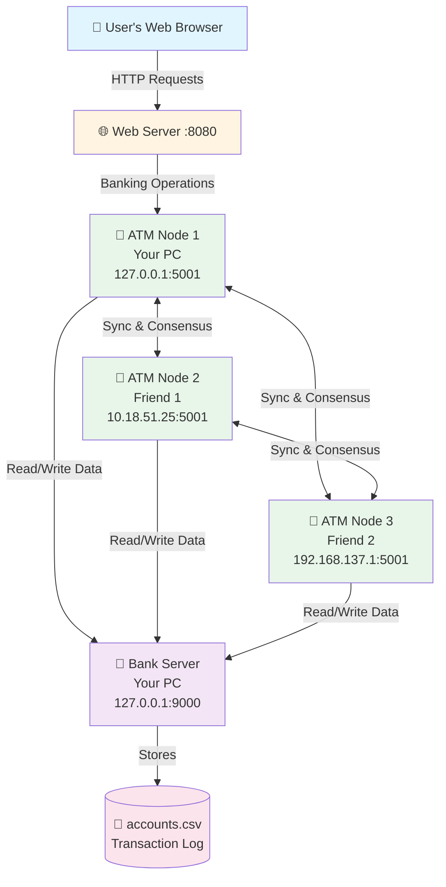
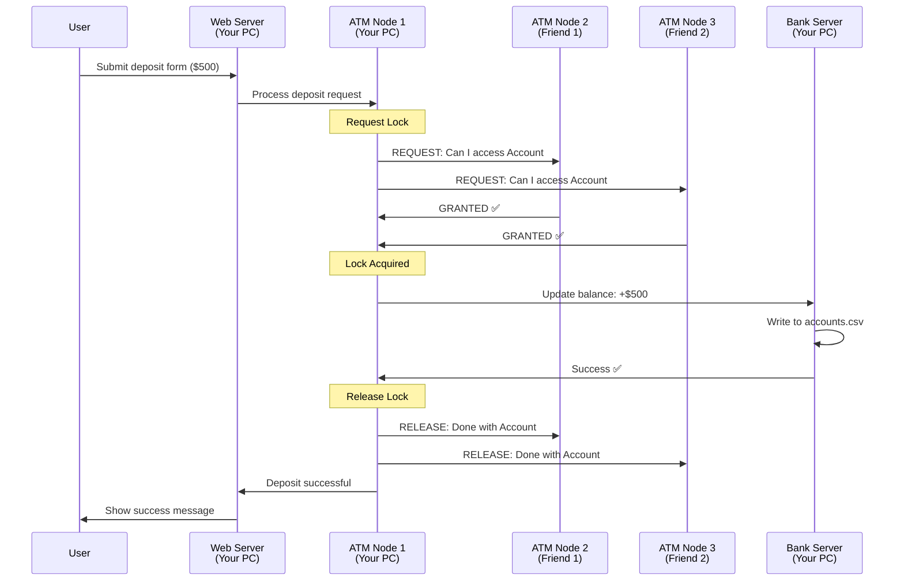

# 🏦 Decentralized Banking System - Architecture & Responsibilities

## 📊 System Overview

Your decentralized banking system is a **distributed application** where multiple computers work together to provide banking services. Here's how it works:



---

## 🖥️ YOUR COMPUTER (The Main Hub)

Your computer runs **THREE** components:

### 1️⃣ Bank Server (Port 9000)
**File**: `BankServer.java`  
**Command**: `.\run_server.bat`

#### 🎯 Responsibilities:
- **Central Database Manager** - Stores all account data in `accounts.csv`
- **Transaction Logger** - Records every transaction with timestamps
- **Data Provider** - Serves account information to all ATM nodes
- **Persistence Layer** - Ensures data survives system restarts

#### 💼 What It Does:
```
✅ CREATE account records
✅ READ account balances
✅ UPDATE account balances
✅ DELETE accounts (if needed)
✅ Log all transactions to file
✅ Respond to queries from ATM nodes
```

#### 📝 Example Operations:
- When ATM1 needs to check a balance → Server reads from `accounts.csv`
- When ATM2 processes a deposit → Server updates `accounts.csv`
- When ATM3 creates an account → Server adds new row to `accounts.csv`

---

### 2️⃣ ATM Node 1 (Port 5001)
**File**: `ATMApp.java`  
**Command**: `.\run_atm.bat 1`

#### 🎯 Responsibilities:
- **Transaction Processor** - Handles deposits, withdrawals, transfers
- **Peer Coordinator** - Communicates with ATM2 and ATM3
- **Mutual Exclusion Manager** - Ensures only ONE transaction at a time
- **Consensus Participant** - Votes on transaction approval

#### 💼 What It Does:
```
✅ Process user transactions
✅ Request permission from other ATMs before executing
✅ Broadcast transaction notifications to peers
✅ Maintain consistency across all nodes
✅ Handle local web server requests
```

#### 🔐 Distributed Locking (Mutual Exclusion):
When a user tries to withdraw money:
1. ATM1 asks ATM2 and ATM3: "Can I process this transaction?"
2. If both say "YES" → ATM1 proceeds
3. If any says "NO" (busy) → ATM1 waits
4. After transaction → ATM1 tells peers: "Transaction complete!"

---

### 3️⃣ Web Server (Port 8080)
**File**: `WebServer.java`  
**Command**: Runs automatically with the server

#### 🎯 Responsibilities:
- **User Interface Host** - Serves HTML pages (login, signup, dashboard)
- **HTTP Request Handler** - Processes form submissions
- **ATM Bridge** - Forwards requests to ATM1
- **Session Manager** - Tracks logged-in users

#### 💼 What It Does:
```
✅ Serve web pages (signup.html, login.html, dashboard.html)
✅ Handle user registration
✅ Process login requests
✅ Execute deposits/withdrawals/transfers via ATM1
✅ Return results to user's browser
```

#### 🌐 User Flow:
```
User fills form → Web Server receives → Forwards to ATM1 → 
ATM1 coordinates with peers → Server updates database → 
Result back to Web Server → Displayed to user
```

---

## 👥 FRIEND 1's COMPUTER (ATM Node 2)

**IP**: `10.18.51.25:5001`  
**Command**: `.\run_atm.bat 2`

### 🎯 Responsibilities:
- **Peer Transaction Processor** - Can independently process transactions
- **Consensus Voter** - Approves/denies transaction requests from other ATMs
- **Data Synchronizer** - Keeps in sync with ATM1 and ATM3
- **Backup Processor** - Can take over if ATM1 fails

### 💼 What It Does:
```
✅ Vote on transaction requests from ATM1 and ATM3
✅ Process transactions if users connect directly to it
✅ Maintain distributed lock coordination
✅ Ensure no conflicting transactions happen
✅ Communicate with Bank Server for data
```

### 📡 Example Scenario:
```
ATM1: "I want to withdraw $100 from Account #12345"
ATM2: Checks if it's also processing Account #12345
       → If NO: "Approved! Go ahead"
       → If YES: "Denied! I'm busy with that account"
```

---

## 👥 FRIEND 2's COMPUTER (ATM Node 3)

**IP**: `192.168.137.1:5001`  
**Command**: `.\run_atm.bat 3`

### 🎯 Responsibilities:
**IDENTICAL to ATM Node 2** - Same responsibilities, different location

### 💼 What It Does:
```
✅ Vote on transaction requests from ATM1 and ATM2
✅ Process transactions independently
✅ Participate in distributed consensus
✅ Ensure system-wide consistency
✅ Provide redundancy and fault tolerance
```

---

## 🔄 How They Work Together

### Example: User Deposits $500



---

## 🎯 Key Distributed Features

### 1. **Mutual Exclusion** (No Conflicts)
- Only ONE ATM can modify an account at a time
- Prevents race conditions (e.g., double withdrawals)
- Uses **Ricart-Agrawala Algorithm** or similar consensus

### 2. **Fault Tolerance**
- If ATM1 crashes, ATM2 and ATM3 can still work
- If Server crashes, system stops (single point of failure)
- Multiple ATMs provide redundancy

### 3. **Distributed Consensus**
- All ATMs must agree before a transaction proceeds
- Majority voting ensures consistency
- Prevents conflicting operations

### 4. **Data Consistency**
- All ATMs see the same account data
- Server is the single source of truth
- Transactions are atomic (all-or-nothing)

---

## 📋 Component Summary Table

| Component | Location | Port | Main Job | Can Process Transactions? |
|-----------|----------|------|----------|---------------------------|
| **Bank Server** | Your PC | 9000 | Store data in CSV | ❌ No (only stores) |
| **Web Server** | Your PC | 8080 | Serve web pages | ❌ No (only forwards) |
| **ATM Node 1** | Your PC | 5001 | Process transactions | ✅ Yes |
| **ATM Node 2** | Friend 1 | 5001 | Process transactions | ✅ Yes |
| **ATM Node 3** | Friend 2 | 5001 | Process transactions | ✅ Yes |

---

## 🔐 Why This Design?

### Centralized Database (Server)
- **Pro**: Simple, consistent, easy to manage
- **Con**: Single point of failure
- **Why**: For a school project, this balances complexity and functionality

### Distributed ATMs (Nodes)
- **Pro**: Demonstrates distributed systems concepts
- **Pro**: Fault-tolerant transaction processing
- **Pro**: Prevents race conditions
- **Why**: Shows real-world distributed computing challenges

---

## 🚀 Startup Order

**CRITICAL**: Start components in this order:

1. **Bank Server** (Your PC)
   ```cmd
   .\run_server.bat
   ```
   Wait for: `[INFO] Bank Server started on port 9000`

2. **ATM Node 1** (Your PC)
   ```cmd
   .\run_atm.bat 1
   ```
   Wait for: `[INFO] ATM Node 1 started`

3. **ATM Node 2** (Friend 1's PC)
   ```cmd
   .\run_atm.bat 2
   ```

4. **ATM Node 3** (Friend 2's PC)
   ```cmd
   .\run_atm.bat 3
   ```

5. **Access Web Interface**
   - Open browser: `http://127.0.0.1:8080`

---

## 💡 Real-World Analogy

Think of it like a **bank branch network**:

- **Bank Server** = Central bank vault (stores all money/data)
- **ATM Nodes** = Physical ATM machines in different locations
- **Web Server** = Bank's website/mobile app
- **Mutual Exclusion** = Preventing two ATMs from dispensing the same money twice

When you withdraw at ATM1, it checks with ATM2 and ATM3 to make sure no one else is accessing your account at the same time!

---

## 🎓 Educational Value

This project demonstrates:
- ✅ **Distributed Systems** - Multiple computers working together
- ✅ **Mutual Exclusion** - Preventing race conditions
- ✅ **Consensus Algorithms** - Coordinating distributed decisions
- ✅ **Client-Server Architecture** - Web interface + backend
- ✅ **Network Programming** - Socket communication
- ✅ **Concurrency Control** - Managing simultaneous access

---

## 🔍 Monitoring Your System

### Check if Server is Running:
```cmd
netstat -an | findstr 9000
```

### Check if ATM Nodes are Running:
```cmd
netstat -an | findstr 5001
```

### Check if Web Server is Running:
```cmd
netstat -an | findstr 8080
```

### View Server Logs:
```cmd
type server_log.txt
```

---

## ❓ FAQ

**Q: Can ATM2 or ATM3 work without ATM1?**  
A: Yes! Any ATM can process transactions independently. They just need the Server running.

**Q: What if the Server crashes?**  
A: All ATMs stop working because they can't access account data.

**Q: Can users connect directly to ATM2 or ATM3?**  
A: Technically yes, but the Web Server only talks to ATM1. You'd need to modify the code.

**Q: Why do we need 3 ATMs?**  
A: To demonstrate distributed consensus. With 3 nodes, you can see how they coordinate and vote.

**Q: What happens if ATM2 and ATM3 disagree?**  
A: The requesting ATM (e.g., ATM1) needs approval from ALL peers, so the transaction would be delayed until consensus is reached.

---

**Summary**: Your PC is the "main hub" running the database, web interface, and one ATM. Your friends' computers run additional ATMs that coordinate with yours to ensure safe, consistent banking operations! 🏦
